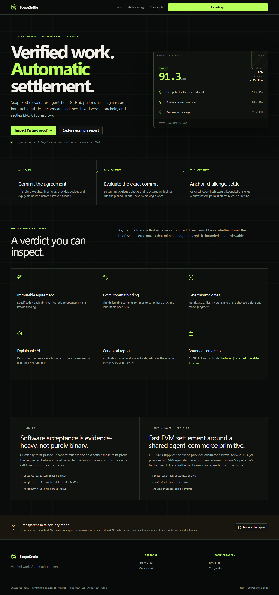
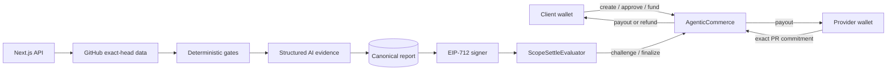

# ScopeSettle

> **Verified work. Automatic settlement.**

ScopeSettle is an explainable AI evaluator and settlement layer for agent-to-agent work. A client
funds an ERC-8183 coding job on X Layer, a provider commits an exact public GitHub pull request,
and ScopeSettle produces an evidence-linked verdict that can settle escrow after a challenge window.

**Launch status:** the beta is implemented and tested. Its X Layer Testnet lifecycle and X Layer
Mainnet contracts are source-verified, and deterministic Testnet job `2` completed onchain. The
public [submission proof](https://tang-vu.github.io/scopesettle/) links the canonical receipts.
Hosted AI evaluation and the demo video remain pending and are never represented by placeholders.



## The narrow problem

Payment protocols can move funds but cannot decide whether offchain work met an agreed scope.
ScopeSettle makes the agreement machine-readable before funding, separates deterministic validation
from semantic AI review, cites evidence for each score, and binds the exact deliverable/report to an
onchain lifecycle. It is agent-commerce infrastructure—not a marketplace, reputation profile, or
generic chatbot.

## Workflow

1. Client defines public repository, provider, budget, expiry, weighted rubric, score/confidence
   thresholds, and challenge window.
2. The browser displays canonical specification/rubric hashes, then creates and funds the six-state
   ERC-8183 escrow without taking custody. Confirmed steps are checkpointed by wallet, deployment,
   and specification hash, so a rejected later transaction resumes instead of creating a duplicate.
3. Provider pins and submits owner/repository/PR/base/head SHA as a deliverable hash.
4. Server verifies onchain state and bounded GitHub data for that exact head, then runs deterministic
   gates and structured AI criterion review.
5. Code validates citations, recomputes the weighted score/confidence, canonicalizes/hashes the
   report, and signs a replay-protected EIP-712 verdict.
6. The evaluator contract records the proposal. Eligible unchallenged verdicts settle
   permissionlessly; challenged or ambiguous results require the trusted reviewer.

## Why AI and X Layer are essential

Tests and metadata can prove identity or CI status, but not whether a nuanced acceptance criterion
was satisfied. The model evaluates semantics; deterministic code controls identity, bounds, schema,
evidence, score math, thresholds, and failure policy. X Layer anchors the funded agreement,
deliverable, verdict evidence, challenge, and payout/refund in an EVM-compatible public record with
OKB gas. The web server never holds user funds.

## Architecture



- `AgenticCommerce.sol`: non-upgradeable, zero-fee, one-token escrow with Open → Funded →
  Submitted → Completed/Rejected/Expired semantics.
- `ScopeSettleEvaluator.sol`: trusted-signer verdict verification, nonce/domain replay protection,
  immutable threshold checks, bounded challenge, and separate manual reviewer.
- Next.js App Router: accessible product UI, injected/EIP-1193 wallet interactions, nonce/SIWE-style
  authentication, RPC reconciliation, GitHub ingestion, evaluation, and report APIs.
- PostgreSQL/Drizzle: expiring single-use nonces, immutable job documents, pinned deliverables, and
  reports, plus atomic per-job evaluation leases and per-wallet hourly AI quotas. The database
  cannot fabricate settlement; contract reads remain authoritative.

See [architecture](docs/architecture.md), [methodology](docs/evaluation-methodology.md), and
[threat model](docs/threat-model.md).

## Repository

```text
apps/web             Next.js UI, APIs, wallet flows, evaluator, browser tests
contracts            Solidity contracts, deploy scripts, unit/fuzz/invariant tests
packages/shared      Zod schemas, canonical hashing, chain definitions, ABIs
docs                  research, architecture, security, methodology, deployment
.github/workflows    PR/default-branch CI and protected manual deployment
```

## Local setup

Requirements: Node 22+, pnpm 11.20, PostgreSQL, and stable Foundry (`forge`, `anvil`, `cast`).

```powershell
pnpm install --frozen-lockfile
Copy-Item .env.example apps/web/.env.local
pnpm --filter @scopesettle/web db:migrate
pnpm dev
```

Configure only the variables needed for your mode. `SESSION_SECRET` must be at least 32 random
characters. `OPENAI_API_KEY`, `OPENAI_MODEL`, `EVALUATOR_PRIVATE_KEY`, and `DATABASE_URL` are
server-only. Never use `NEXT_PUBLIC_*` for a secret. `GITHUB_TOKEN` is optional and only raises
public API limits. No production mock model fallback exists.

For a local chain and Testnet/Mainnet runbooks, see [deployment instructions](docs/deployment-runbook.md).

## Commands

| Command                                     | Purpose                                                            |
| ------------------------------------------- | ------------------------------------------------------------------ |
| `pnpm dev`                                  | start web development server                                       |
| `pnpm check`                                | formatting, lint, types, unit/contract/E2E tests, production build |
| `pnpm test`                                 | shared/web unit tests plus Foundry tests                           |
| `pnpm contracts:coverage`                   | Solidity coverage summary and LCOV                                 |
| `pnpm test:e2e`                             | Playwright public/mobile/a11y and isolated wallet lifecycle paths  |
| `pnpm --filter @scopesettle/web db:migrate` | apply checksummed, lock-protected PostgreSQL migrations            |

CI runs the migration set twice against an ephemeral PostgreSQL 17 service to verify both schema
application and idempotency. Applied migration files must never be edited in place.

Automated tests never make paid model calls. The mock provider throws if constructed in production.

Latest local production audit (Lighthouse 13.4.1, 2026-08-10): desktop scored 99 performance,
100 accessibility, 100 best practices, and 100 SEO; mobile throttling scored 82/100/100/100.
Both runs reported zero cumulative layout shift. Wallet libraries are loaded only on transaction
routes, keeping the public landing route independent of the wagmi/viem client bundle. Scores are
local audit evidence, not claims about an as-yet-unpublished hosting environment.

## Networks and deployments

Official configuration is recorded in [verified research](docs/research.md). X Layer Testnet is
chain `1952`; Mainnet is `196`; both use OKB gas. The source-verified Testnet mock stack, completed
Testnet lifecycle, and source-verified Mainnet pair are recorded in the live
[deployment ledger](docs/deployments.md). Because no official faucet USDG address is published,
the beta uses an explicitly valueless, chain-guarded `MockUSDG`; the Mainnet pair uses official
native USDC and cannot use that mock script.

## Security model and limitations

The evaluator signer and reviewer are trusted. Model output, GitHub metadata, and CI may be wrong or
malicious. Repository code is never executed. URLs are restricted to public `https://github.com`
forms and requests go only to fixed `api.github.com`; responses/diffs are bounded. Token transfers
use SafeERC20, reentrancy protection, expected-budget checking, and fee-on-transfer rejection.
Authenticated evaluation is limited to three new runs per wallet per UTC-aligned hour and one
active lease per job; completed reports are reused instead of calling the model again.
Indexed lifecycle writes must carry a successful commerce-contract receipt containing the exact
`JobCreated` or `JobSubmitted` event for that job ID. Resumed funding also reconciles its local
checkpoint with the creation receipt, current job state, budget, and token allowance before it can
request another wallet transaction.

The contracts are unaudited immutable beta software. Do not use meaningful Mainnet funds. A full
dispute court, private repositories, arbitrary uploads, milestones, cross-chain flows, custom token,
and platform fees are intentionally out of scope. Read [SECURITY.md](SECURITY.md) before use.

## Submission and roadmap

The source-verified contracts now have a completed valueless Testnet lifecycle with a dedicated EOA
provider. It is explicitly a deterministic contract-wiring proof, not an AI evaluation. The
Mainnet contracts are deployed and source-verified; no Mainnet job or user activity is claimed.
The remaining release gate is the public hosted OpenAI-backed workflow and judge demo.
Submission copy, demo script, and launch thread are in [SUBMISSION.md](SUBMISSION.md),
[DEMO.md](DEMO.md), and [X_THREAD.md](X_THREAD.md).

Licensed under [MIT](LICENSE).
