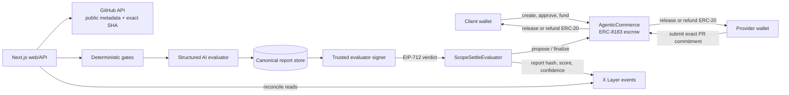

# Architecture

ScopeSettle is a narrow evaluation and settlement system for public GitHub pull-request work.
Onchain escrow is authoritative; the web/database layer cannot fabricate settlement.

## Components and trust boundaries

`AgenticCommerce` implements the minimal six-state escrow with one immutable token and no
fee/admin withdrawal. A ScopeSettle job adds immutable specification and rubric commitments
plus score, confidence, and challenge policy. The provider submits a `bytes32` commitment
covering repository identity, PR number, and exact head SHA.

`ScopeSettleEvaluator` is the job evaluator address. It verifies a server-held signer's EIP-712
verdict, binds it to this chain/contract/job/deliverable/report/nonce/deadline, and records the
proposal. Eligible unchallenged proposals can be finalized by anyone after the challenge
window. Either party can challenge; challenged or model-ambiguous outcomes require the named
reviewer. This is a transparent trusted-evaluator system, not a trustless AI oracle.

The Next.js server verifies wallet sessions, reads the onchain job, ingests bounded GitHub data
for the exact commit, runs deterministic gates, sends hostile repository content to a structured
model prompt with explicit data delimiters, validates the output, recomputes the weighted score,
canonicalizes and hashes the report, persists evidence, and only then prepares/signs a verdict.

PostgreSQL stores expiring single-use auth nonces, evaluation runs, and reports. It may cache
public metadata, but all job state and settlement displays are reconciled against RPC reads/events.
The public example is clearly labeled local fixture data until a real Testnet job exists.

## Canonical commitments

- Specification/rubric JSON uses deterministic recursive key ordering and UTF-8 encoding.
- `keccak256` commits the resulting bytes for EVM-native verification.
- Deliverable commitment includes schema version, normalized owner/repository, PR number,
  base SHA, and pinned head SHA.
- The report excludes `reportHash` while hashing; the displayed object then adds that hash.
- EIP-712 domain separation supplies chain ID and verifying contract replay protection.

## Failure policy

Invalid URL/input, stale head SHA, oversized/binary-only diffs, low confidence, schema-invalid
model output, provider outage, or insufficient time before expiry fails closed to manual review;
production never substitutes the deterministic mock evaluator.
